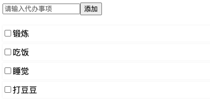

# TypeScript版本-使用 React 和 Redux 构建的 TodoMVC (props&Event&Context&Mobx&Redux)



```js
npm i -S redux react-redux @types/react-redux

npm i mobx mobx-react
```

1. todoList项目初始化
2. props与event
3. context对象
4. useReducer优化
5. redux使用
6. mobx
7. useEffect使用